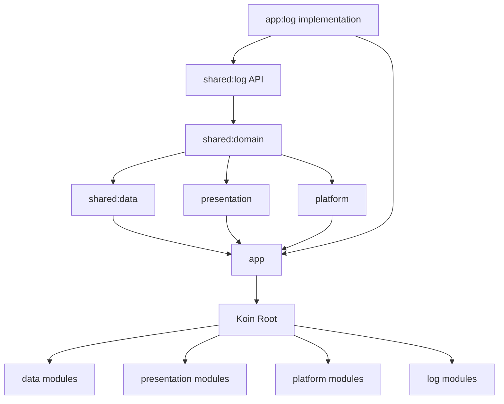

<!--firebender-plan
name: KMP 전환 마무리
overview: 현재 KMP 전환 브랜치에서 남은 작업을 log 모듈 재배치, java.time 제거, Koin 전면 적용의 3단계로 나누어 안전하게 마무리합니다. 각 단계는 빌드에 포함된 모듈부터 정리하고, 검증은 Gradle 빌드/테스트와 검색 기반 잔여 사용처 확인으로 진행합니다.
todos:
  - id: move-log
    content: "log API를 shared:log로 옮기고 log 구현을 app 전용 모듈로 재배치한다."
  - id: replace-java-time
    content: "domain/data/presentation/platform/app의 java.time 사용을 kotlinx-datetime 기반으로 교체한다."
  - id: apply-koin
    content: "app, presentation, platform, log 구현의 Hilt/수동 DI를 Koin으로 전환한다."
  - id: cleanup-legacy
    content: "빌드 대상이 아닌 루트 domain/data 잔여 디렉터리와 테스트 영향 범위를 분리 점검한다."
  - id: verify-build
    content: "잔여 사용처 검색, Gradle sync, 주요 모듈 컴파일/테스트로 전환 결과를 검증한다."
-->

# KMP 전환 마무리 계획

## 확인된 현재 상태
- [settings.gradle.kts](settings.gradle.kts)는 현재 `:app`, `:presentation`, `:platform`, `:log:log-api`, `:log:log-impl`, `:shared:domain`, `:shared:data`, `:shared:file-share`, `:desktop`를 포함합니다.
- [shared/domain/build.gradle.kts](shared/domain/build.gradle.kts)는 KMP 모듈이지만 `api(project(":log:log-api"))`로 루트 `log` 모듈에 의존합니다.
- [app/src/main/java/com/kintmin/jellytube/JellyTubeApplication.kt](app/src/main/java/com/kintmin/jellytube/JellyTubeApplication.kt)는 `startKoin`과 `@HiltAndroidApp`/`HiltWorkerFactory`가 혼재합니다.
- [shared/data/src/commonMain/kotlin/com/kintmin/data/di/DataCommonModule.kt](shared/data/src/commonMain/kotlin/com/kintmin/data/di/DataCommonModule.kt)는 이미 Koin 중심으로 repository/usecase를 등록합니다.
- [presentation/build.gradle.kts](presentation/build.gradle.kts), [platform/build.gradle.kts](platform/build.gradle.kts), [app/build.gradle.kts](app/build.gradle.kts)는 아직 Hilt plugin/dependency/ksp가 남아 있습니다.
- `java.time`은 `shared/domain`, `shared/data`, `presentation`, `platform`에 남아 있으며, 특히 step 날짜 계산과 media/playlist 모델의 `LocalDateTime`이 핵심 영향 지점입니다.

## 1단계: log 모듈을 KMP 구조에 맞게 재배치
- 루트 `:log:log-api`를 `:shared:log` 형태의 KMP 공용 API 모듈로 이동합니다.
- `shared:domain`, `presentation`, `platform`, `app`의 log API 의존성을 `project(":shared:log")`로 바꿉니다.
- 기존 `:log:log-impl`은 앱 전용 구현으로 `:app:log` 또는 `app/log` 하위 Android library 모듈로 이동합니다.
- `AppLogImpl`과 `LogImplModule`은 Hilt가 아닌 Koin 모듈로 전환합니다.
- `settings.gradle.kts`와 관련 Gradle 파일의 include/dependency를 정리합니다.

## 2단계: `java.time`을 `kotlinx-datetime`으로 교체
- [gradle/libs.versions.toml](gradle/libs.versions.toml)에 `kotlinx-datetime` 의존성을 추가하고 필요한 모듈에 연결합니다.
- `shared/domain`의 공용 모델과 확장 함수를 먼저 교체합니다.
  - `AudioTrack`, `AudioMedia`, `Playlist`: `java.time.LocalDateTime` 제거
  - `LongExtension`, `LocalDateTimeExtension`: epoch millis 변환을 `kotlinx.datetime.Instant`, `TimeZone`, `LocalDateTime` 기반으로 변경
- step 관련 use case의 날짜 계산을 `LocalDate`, `LocalTime`, `DatePeriod`, `TimeZone.currentSystemDefault()` 기반으로 변경합니다.
  - `GetMonthlyDailyStepsUseCase`
  - `GetHalfHourlyStepsUseCase`
  - `ResetDataOncePerDayUseCase`
  - `UpdateLastStepSensorUseCase`
- `shared/data`의 repository/mapper 포맷 처리를 `kotlinx-datetime` 기반 유틸로 통일합니다.
  - `StepRepositoryImpl`
  - `AppLogRepositoryImpl`
  - audio/playlist mapper
- `presentation`의 UI 상태와 화면 날짜 타입/포맷을 `kotlinx-datetime`으로 바꿉니다.
  - `StepViewModel`, `StepUiState`, `StepIntent`, `StepScreen`, `StepCalendarView`
  - `AudioMediaDetailUiState`, `AudioMediaEditUiState`
- `platform`의 worker/service 날짜 경계 계산을 동일한 공용 유틸 또는 `kotlinx-datetime` 직접 사용으로 교체합니다.
- `app/build.gradle.kts`의 APK 파일명 타임스탬프 생성부도 `java.time` 제거 대상에 포함합니다.

## 3단계: Koin을 app/presentation/platform 전체에 적용
- `app`에서 Hilt 초기화를 제거하고 Koin 초기화를 단일 진입점으로 만듭니다.
  - `@HiltAndroidApp`, `HiltWorkerFactory`, Hilt `Configuration.Provider` 제거
  - `startKoin { androidContext(...); modules(...) }`에 app/log/platform/presentation/data 모듈을 모두 연결
- `presentation`에 Koin ViewModel 모듈을 추가합니다.
  - 기존 `@HiltViewModel` + `@Inject constructor`를 Koin `viewModel` 등록 방식으로 전환
  - Compose 쪽 ViewModel 획득을 `hiltViewModel`이 아닌 Koin 방식으로 전환
- `platform`에 Koin 모듈을 추가합니다.
  - `PlatformModule`, `WorkerModule`의 Hilt 제공 항목을 Koin DSL로 이전
  - `StepForegroundService`, `FileShareForegroundService`의 field injection은 `by inject()` 또는 명시적 Koin lookup으로 변경
  - `Worker`류는 Koin WorkerFactory 또는 Koin 기반 worker 등록 방식으로 전환
- `app`, `presentation`, `platform`, `log-impl`의 Hilt plugin/dependency/ksp를 제거하고 필요한 Koin 의존성을 추가합니다.

## 4단계: 레거시/중복 디렉터리 점검
- 검색 결과에 루트 `domain/`, `data/` 테스트 디렉터리도 일부 잡혔습니다.
- 이 디렉터리들이 현재 Gradle include 대상이 아니면 빌드 대상에서는 제외하되, 필요하면 별도 후속 정리 대상으로 분리합니다.
- 이번 작업의 우선순위는 `settings.gradle.kts`에 포함된 실제 모듈입니다.

## 5단계: 검증
- `java.time` 잔여 사용처 검색으로 `domain`, `data`, `presentation`, `platform`, `app` 내 제거 여부를 확인합니다.
- Hilt 잔여 사용처 검색으로 `@HiltViewModel`, `@AndroidEntryPoint`, `@HiltWorker`, `@Inject`, `hiltViewModel`, Hilt Gradle dependency 제거 여부를 확인합니다.
- Gradle sync 후 가능한 범위에서 빌드/테스트를 실행합니다.
  - 우선 `:shared:domain`, `:shared:data`, `:presentation`, `:platform`, `:app` 컴파일
  - 이후 관련 unit test 실행

## 예상 리스크와 대응
- `kotlinx-datetime`은 `java.time.format.DateTimeFormatter`와 동일한 포맷 API를 제공하지 않으므로, 화면 표시용 포맷 함수는 간단한 수동 포맷 유틸로 대체합니다.
- Android `Worker` 생성은 일반 객체 주입과 다르므로, Koin WorkerFactory 적용 여부를 별도로 검증합니다.
- log 구현을 `app` 하위로 옮기면 `shared:domain`이 구현을 몰라야 하므로, domain은 `shared:log` API만 바라보도록 유지합니다.

