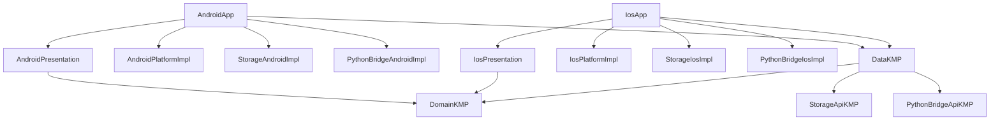

<!--firebender-plan
name: KMP Core Migration
overview: Android 앱의 기존 동작을 유지하면서 `domain`/`data`와 `python-bridge-api`/`storage-api`만 KMP로 전환하고, Android/iOS 구현과 UI는 플랫폼별로 분리하는 모노레포 전환 계획입니다. CMP UI 공유는 이번 범위에서 제외하고, iOS가 공통 로직을 참조할 수 있는 최소 기반을 만드는 데 집중합니다.
todos:
  - id: baseline-audit
    content: "Establish Android build, test, app-size, and main-flow baseline before KMP migration."
  - id: extract-api-modules
    content: "Create KMP `python-bridge-api` and `storage-api` modules and move only interfaces/models into them."
  - id: split-android-impl
    content: "Move current Chaquopy and FileManager implementations behind Android-only impl modules without changing behavior."
  - id: convert-di
    content: "Replace shared-layer Hilt usage with Koin-compatible module wiring while keeping Android behavior stable."
  - id: convert-domain-kmp
    content: "Convert `domain` to KMP and remove JVM-only dependencies from common code."
  - id: convert-data-kmp
    content: "Convert `data` to KMP and depend only on KMP API modules plus platform factories."
  - id: bootstrap-ios-app
    content: "Add an iOS app skeleton and verify it can link and call the KMP core with stub implementations."
  - id: verify-android-regression
    content: "Run Android regression checks and compare app size/performance against the baseline."
-->

# KMP Core Migration Plan

## 목표와 범위

- **목표**: iOS 앱이 Android와 동일한 `domain`/`data` 로직을 공유할 수 있도록 KMP 기반 core를 만든다.
- **포함**:
  - `domain` KMP화
  - `data` KMP화
  - `python-bridge-api` KMP 모듈 분리
  - `storage-api` KMP 모듈 분리
  - Android 구현은 기존 동작 유지
  - iOS app skeleton에서 KMP framework 링크 검증
- **제외**:
  - CMP 기반 공통 UI 전환
  - `platform` KMP화
  - iOS `libPython + yt-dlp` 완성 구현
  - Android `app` → `android-app` rename은 안정화 후 마지막 단계

## 핵심 아키텍처

## 권장 작업 순서

### Phase 0. 기준선 고정

- 현재 Android 앱이 정상 빌드/테스트되는 상태를 기준선으로 잡는다.
- 변경 전후 비교용으로 앱 크기, cold start, 주요 플로우를 기록한다.
- 주요 파일:
  - [`settings.gradle.kts`](settings.gradle.kts)
  - [`gradle/libs.versions.toml`](gradle/libs.versions.toml)
  - [`app/build.gradle.kts`](app/build.gradle.kts)
  - [`data/build.gradle.kts`](data/build.gradle.kts)
  - [`domain/build.gradle.kts`](domain/build.gradle.kts)

### Phase 1. API 모듈 먼저 분리

- `python-bridge-api` KMP 모듈을 만든다.
  - 기존 [`PythonExecutor`](data/src/main/java/com/kintmin/data/python_bridge/PythonExecutor.kt)를 이동한다.
  - Android 구현 [`PythonExecutorImpl`](data/src/main/java/com/kintmin/data/python_bridge/PythonExecutorImpl.kt)은 Android impl 영역에 남긴다.
- `storage-api` KMP 모듈을 만든다.
  - 기존 [`FileManager`](data/src/main/java/com/kintmin/data/local_file/FileManager.kt)를 이동한다.
  - Android 구현 [`FileManagerImpl`](data/src/main/java/com/kintmin/data/local_file/FileManagerImpl.kt)은 Android impl 영역에 남긴다.
- 이 단계에서는 `data` 자체를 아직 KMP로 바꾸지 말고, Android 동작 유지에 집중한다.

### Phase 2. Android impl 분리 및 의존 방향 정리

- Android 전용 구현을 명확히 분리한다.
  - `python-bridge-android-impl`
  - `storage-android-impl`
- `data`는 구현 클래스가 아니라 `python-bridge-api`, `storage-api` interface만 보도록 변경한다.
- Android app 조립부에서 실제 구현을 주입한다.
- 성공 기준:
  - Android 앱 기능 유지
  - Python 다운로드 기능 유지
  - 로컬 파일 저장/메타데이터/로그 기능 유지

### Phase 3. DI 전환 전략 적용

- Hilt를 한 번에 제거하지 말고, 먼저 API/impl 경계에 맞춰 DI 조립 지점을 좁힌다.
- 이후 KMP 공통부부터 Koin module로 전환한다.
- 권장 순서:
  - `domain`의 `javax.inject` 제거
  - `data`의 Hilt module 제거
  - Android app에서 Koin 시작
  - Android impl들을 Koin module로 등록
- Android 전용 WorkManager/Service 주입은 마지막에 처리한다.

### Phase 4. `domain` KMP화

- [`domain/build.gradle.kts`](domain/build.gradle.kts)를 Kotlin JVM 모듈에서 KMP 모듈로 전환한다.
- `commonMain` 중심으로 usecase/model을 이동한다.
- JVM 전용 API를 정리한다.
  - `javax.inject` 제거
  - `java.time` → `kotlinx-datetime`
  - `java.util.UUID` → KMP UUID provider 또는 별도 abstraction
  - JVM concurrent/atomic API 정리
- 성공 기준:
  - Android target 컴파일
  - iOS target 컴파일
  - 기존 domain unit test를 KMP test 구조로 일부 이전

### Phase 5. `data` KMP화

- [`data/build.gradle.kts`](data/build.gradle.kts)를 Android library에서 KMP 모듈로 전환한다.
- Android 전용 구현은 제거 또는 sourceSet 분리한다.
- `data`에서 빠져야 할 것:
  - `PythonExecutorImpl`
  - `FileManagerImpl`
  - Android `Context` 기반 DataStore provider
  - Android `Room.databaseBuilder`
  - Hilt module
  - Android Manifest/permission 성격 코드
  - 이메일 전송/공유 같은 platform action
- DB/설정 저장소는 KMP sourceSet 구조로 재구성한다.
  - `commonMain`: repository, mapper, DAO-facing abstraction
  - `androidMain`: Android DB/DataStore factory
  - `iosMain`: iOS DB/DataStore factory
- 성공 기준:
  - Android 앱에서 기존 repository 동작 유지
  - iOS target에서 `data` framework compile 성공

### Phase 6. iOS app skeleton 연결

- `iosApp` Xcode project를 추가한다.
- Gradle KMP framework를 Xcode에 연결한다.
- iOS에서 최소 플로우를 검증한다.
  - KMP `domain` 호출
  - KMP `data` repository 생성
  - `storage-api` mock 또는 iOS stub 연결
  - `python-bridge-api` mock 또는 iOS stub 연결
- iOS-specific 구현은 처음에는 stub으로 둔다.
- 성공 기준:
  - iOS simulator 빌드 성공
  - Swift/SwiftUI 또는 iOS entry point에서 KMP 객체 호출 성공

### Phase 7. Android 회귀 검증 및 성능/크기 측정

- KMP 도입 후 Android APK/AAB 크기를 이전 기준선과 비교한다.
- 주요 플로우 성능을 확인한다.
  - 앱 시작
  - DB 조회
  - 플레이리스트/오디오 목록
  - 다운로드 시작
  - 파일 저장
- 예상 리스크:
  - Koin 전환으로 런타임 DI 비용 증가 가능
  - KMP 라이브러리 추가로 앱 크기 소폭 증가 가능
  - 구조 변경 중 Flow/Coroutine 계층이 과해질 가능성
- 판단 기준:
  - Android target에는 Kotlin/Native 런타임이 포함되지 않으므로 KMP 자체로 앱 크기가 폭증하지는 않는다.
  - 기존 Chaquopy, Media3, Compose, Firebase 영향이 더 클 가능성이 높다.

## 병렬 작업 오케스트레이션

- **Architecture Agent**
  - Gradle 모듈 구조 설계
  - `settings.gradle.kts`, version catalog, sourceSet 전략 정리
  - 의존 방향 위반 감시
- **API Extraction Agent**
  - `PythonExecutor`, `FileManager` API 추출
  - Android impl 분리
  - 기존 Android 기능 회귀 확인
- **Domain KMP Agent**
  - `domain` KMP화
  - JVM 전용 API 제거
  - domain tests 이전
- **Data KMP Agent**
  - `data` KMP화
  - Room/DataStore KMP factory 구조 정리
  - repository가 API interface만 의존하도록 정리
- **Android Integration Agent**
  - Android app/Koin 조립
  - 기존 presentation/platform 동작 유지
  - 앱 크기/성능 비교
- **iOS Bootstrap Agent**
  - `iosApp` skeleton
  - KMP framework 링크
  - iOS stub impl 연결

## 중요한 설계 원칙

- iOS 종속 구현은 KMP interface를 참조할 수 있다.
- 단, 가장 안정적인 방식은 iOS 구현을 Swift-only로 두기보다 `iosMain` 또는 iOS target Kotlin module로 구현하는 것이다.
- Swift `iosApp`은 앱 진입점과 UI 조립 역할을 맡고, core interface 구현은 가능하면 Kotlin/Native 쪽에 둔다.
- CMP UI 공유는 이번 계획에서 제외한다.
- Android 동작 유지를 최우선으로 하며, rename/refactor는 기능 안정화 이후에 진행한다.
