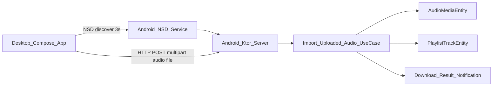

<!--firebender-plan
name: KMP File Share
overview: Android 앱과 Windows Desktop 앱이 같은 네트워크에서 NSD로 자동 발견되고, Desktop에서 드래그 앤 드롭한 음원 파일을 Android Ktor 서버로 업로드하는 KMP/Compose Desktop 기반 파일 공유 기능을 단계적으로 구축합니다. 변경 범위가 커서 4개 실행 단계로 나누고, 각 단계가 독립적으로 빌드/검증되도록 진행합니다.
todos:
  - id: plan1-kmp-foundation
    content: "KMP/shared 및 Compose Desktop 빌드 기반을 추가하고 최소 빌드를 검증한다."
  - id: plan2-android-server
    content: "Android 설정 화면과 foreground Ktor/NSD 수신 서버를 구현한다."
  - id: plan3-desktop-client
    content: "Desktop NSD discovery, timeout UI, drag & drop 업로드 UI를 구현한다."
  - id: plan4-import-integration
    content: "업로드 파일 저장, AudioMediaEntity/playlist 연결, notification 발송까지 통합한다."
-->

# KMP Android-Desktop 파일 공유 단계별 계획

## 전제 및 결정 사항

- Desktop 앱은 **Compose Desktop**으로 새 모듈을 추가합니다.
- Android 수신 서버는 **Foreground Service + Ktor embedded server**로 구성합니다.
- 서버 종료는 **Android 화면의 명시적 중지 버튼**과 **foreground notification 액션**에서 지원합니다.
- 기존 `Quick Share` 안내 UI 패턴은 [SettingShareScreen.kt](presentation/src/main/java/com/kintmin/presentation/ui/setting/share/SettingShareScreen.kt)를 참고합니다.
- 받은 파일 저장/DB/playlist 연결은 기존 [ImportSharedAudioMediaUseCase.kt](domain/src/main/java/com/kintmin/domain/audio_media/usecase/ImportSharedAudioMediaUseCase.kt), [AudioMediaRepositoryImpl.kt](data/src/main/java/com/kintmin/data/repository_impl/AudioMediaRepositoryImpl.kt), [AudioMediaFacade.kt](data/src/main/java/com/kintmin/data/local_db/dao_facade/AudioMediaFacade.kt)의 흐름을 재사용/확장합니다.

## 전체 흐름

## Plan 1: KMP/Desktop 빌드 기반 추가

목표: 기능 구현 전, 새 모듈과 의존성이 IDE/Gradle에서 안정적으로 인식되도록 최소 골격을 만듭니다.

- [settings.gradle.kts](settings.gradle.kts)에 `:shared:file-share`와 `:desktop` 모듈 include 추가
- [gradle/libs.versions.toml](gradle/libs.versions.toml)에 Kotlin Multiplatform, Compose Multiplatform, Ktor, serialization, coroutines 관련 alias 추가
- 루트 [build.gradle.kts](build.gradle.kts)에 필요한 plugin alias `apply false` 추가
- `shared:file-share` 모듈 생성
  - 공통 DTO: discovery/service name, upload response, upload status enum
  - 공통 상수: NSD service type, HTTP path, WebSocket path, multipart field name
- `desktop` 모듈 생성
  - Compose Desktop 앱 엔트리
  - 아직 실제 discovery/upload 없이 “준비 화면” 정도만 두고 빌드 검증
- 검증
  - Gradle sync
  - `:shared:file-share:build`
  - `:desktop:build`
  - Android 기존 모듈 compile 영향 확인

## Plan 2: Android 파일 공유 받기 화면 + Foreground Ktor 서버

목표: 앱 설정에서 `[파일 공유 받기]` 타일을 누르면 안내 화면으로 이동하고, `[파일 공유 받기 시작]` 버튼으로 Android 수신 서버를 foreground service에서 시작합니다.

- 설정 화면 변경
  - [SettingScreen.kt](presentation/src/main/java/com/kintmin/presentation/ui/setting/SettingScreen.kt)의 기존 “Quick Share로 공유받기”와 별도로 `[파일 공유 받기]` 타일 추가 또는 기존 타일 명칭/목적 분리
  - `SettingIntent`, `SettingEvent`, navigation에 새 route 추가
- 새 화면 추가
  - `SettingFileShareReceiveScreen` 계열 추가
  - `SettingShareScreen.kt`처럼 `Scaffold`, 설명 카드, 흐름도, bottom button 구조 사용
  - 상태: idle, starting, running, stopping, error
  - running 상태에서는 하단 버튼을 `[파일 공유 받기 중지]`로 표시
- Android platform 서버 추가
  - `FileShareForegroundService` 생성
  - Ktor embedded Netty/CIO 서버 실행
  - `/ws/status` WebSocket은 desktop과 연결 상태/서버 상태 전달용으로 열기
  - `/upload` HTTP POST multipart endpoint 준비
  - Android NSD 등록: `_jellytube-share._tcp.` 같은 service type으로 현재 포트 광고
  - notification에 “파일 공유 받는 중” 표시 및 “종료” 액션 추가
- Manifest/권한/의존성
  - [AndroidManifest.xml](app/src/main/AndroidManifest.xml)에 service 등록
  - [platform/build.gradle.kts](platform/build.gradle.kts)에 Ktor server/Android NSD 필요 의존성 추가
  - 필요 시 [app/build.gradle.kts](app/build.gradle.kts) 의존성 연결 확인
- 검증
  - service start/stop 동작
  - notification 액션으로 종료
  - 같은 네트워크에서 NSD service가 보이는지 로그/테스트 앱 수준 확인
  - Android 앱 빌드

## Plan 3: Desktop NSD discovery + 드래그 앤 드롭 업로드 UI

목표: Windows Desktop 앱이 Android 기기를 3초 안에 NSD로 찾고, 파일을 drag & drop해서 HTTP POST로 업로드하며 상태를 표시합니다.

- Desktop discovery
  - 시작 시 NSD discovery 3초 timeout
  - 발견 성공: Android server host/port 연결
  - 실패: 설명글, “앱에서 파일 공유 받기 시작 버튼을 켜주세요” 문구, 새로고침 버튼 표시
  - Android 화면과 유사한 카드/안내 UI 구성
- Desktop upload UI
  - drag & drop으로 음원 파일 1개만 리스트에 표시
  - 상태: 대기, 업로드중, 성공, 실패
  - 실패 시 재시도 버튼 노출
  - 업로드 중 중복 업로드 방지
- HTTP POST
  - `multipart/form-data`로 `/upload`에 파일 전송
  - 성공/실패 response DTO는 `shared:file-share` 공통 모델 사용
  - 필요 시 WebSocket으로 server status 확인 또는 단순 연결 상태 표시
- 검증
  - `:desktop:run`으로 Windows 실행
  - timeout UI 확인
  - Android 서버 발견 후 업로드 요청이 Android endpoint까지 도달하는지 확인

## Plan 4: Android 업로드 저장/DB/playlist/notification 통합

목표: Android가 받은 파일을 실제 앱 내부 파일로 저장하고, `AudioMediaEntity` 추가 및 다운로드 대상 playlist 연결, push notification까지 발송합니다.

- 저장 경로 확장
  - 기존 [FileManager.kt](data/src/main/java/com/kintmin/data/local_file/FileManager.kt)에 content URI가 아닌 uploaded stream/file 기반 복사 메서드 추가
  - `AudioMediaRepository.importSharedAudio(...)`와 중복되는 로직을 공통화하거나 `importUploadedAudio(...)` 추가
  - source는 예: `fileShare://sha256/<hex>`로 저장해 Quick Share와 구분하면서 SHA 중복 체크 유지
- usecase 추가
  - `ImportUploadedAudioMediaUseCase` 생성
  - [ImportSharedAudioMediaUseCase.kt](domain/src/main/java/com/kintmin/domain/audio_media/usecase/ImportSharedAudioMediaUseCase.kt)와 동일하게 `shouldInsertAtTopOnDownload`, `playlistIdOnDownload` resolve
- 서버 endpoint 연결
  - `/upload` multipart 수신 후 임시 파일 저장
  - usecase 호출
  - 성공 시 `audioMediaId`, title 등을 response로 반환
  - 실패 시 Desktop이 재시도할 수 있는 에러 response 반환
- 알림/재생 큐 갱신
  - [YoutubeDownloadWorker.kt](platform/src/main/java/com/kintmin/platform/worker/YoutubeDownloadWorker.kt)의 성공 알림 패턴 참고
  - [DownloadResultNotification.kt](platform/src/main/java/com/kintmin/platform/push_notification/notifications/DownloadResultNotification.kt)를 재사용하거나 “파일 공유 수신 완료” notification 추가
  - 필요 시 현재 재생 컨트롤러에도 추가된 media item 반영
- 검증
  - 업로드 성공 시 [AudioMediaEntity.kt](data/src/main/java/com/kintmin/data/local_db/model/AudioMediaEntity.kt)에 해당 row 추가
  - 다운로드 시 설정된 playlist에 `PlaylistTrackEntity` 연결
  - 성공/실패 notification 발송
  - 중복 파일 업로드 시 실패/재시도 UI 동작
  - Android 및 Desktop 빌드

## 권장 진행 순서

1. **Plan 1 진행**: 빌드 기반만 먼저 확정합니다.
2. **Plan 2 진행**: Android에서 서버를 켜고 끄는 흐름을 완성합니다.
3. **Plan 3 진행**: Desktop에서 발견/업로드 UI를 붙입니다.
4. **Plan 4 진행**: 실제 저장/DB/playlist/notification까지 end-to-end로 묶습니다.

이 순서로 가면 각 단계가 실패해도 원인 범위가 작고, 기존 Android 앱 동작을 깨뜨릴 위험을 줄일 수 있습니다.
